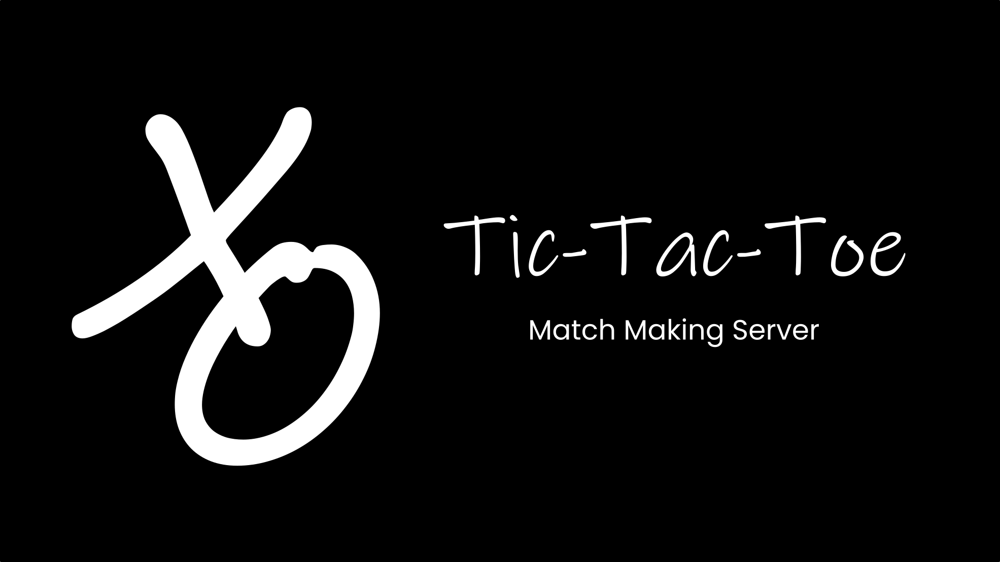

  

Authors          : [MrRhuezzler](https://github.com/MrRhuezzler), [Sakthi](https://github.com/sakthi-priyadharshini), [jddark62](https://github.com/jddark62)  
Project Language : Java  
Project Year     : 2022  

## Short Description
This is a match making server, which accepts connections from many clients and match them as they connect with one another. The server is threaded to handle many clients and their games at once. The match making server is built around the idea of generality, although in my opinion the server became centeric over the game of tic-tae-toe.
